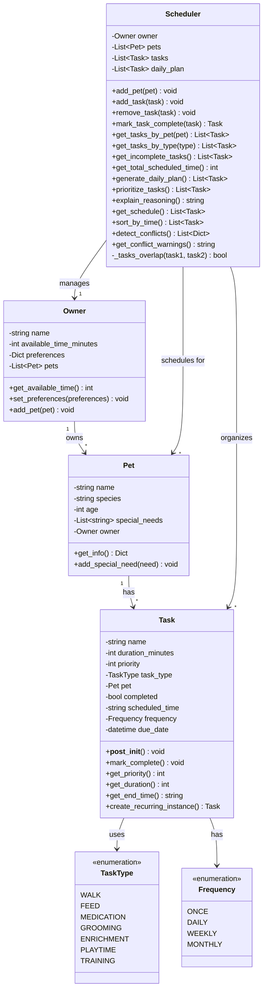

# PawPal+ Final UML Diagram

This is the final system architecture reflecting all implemented features including time-based scheduling, recurring tasks, and conflict detection.

## Mermaid Class Diagram

## Key Relationships

1. **Owner ↔ Pet**: Bidirectional one-to-many relationship
   - Owner maintains a list of pets
   - Each pet has a reference to its owner

2. **Pet → Task**: One-to-many relationship
   - Each pet can have multiple tasks
   - Each task belongs to exactly one pet

3. **Task → TaskType**: Task uses a TaskType enum
   - Enforces standardized task categories

4. **Task → Frequency**: Task has a Frequency enum
   - Defines recurrence pattern (once, daily, weekly, monthly)

5. **Scheduler → Owner**: Scheduler manages one owner
   - Accesses owner's time constraints and preferences

6. **Scheduler → Pet**: Scheduler manages multiple pets
   - Tracks all pets through owner reference

7. **Scheduler → Task**: Scheduler organizes multiple tasks
   - Maintains task list and daily plan

## Design Principles Applied

1. **Separation of Concerns**
   - Data models (Owner, Pet, Task) are separate from logic (Scheduler)
   - Each class has a single, clear responsibility

2. **Encapsulation**
   - Private attributes with public accessor methods
   - Validation logic hidden in __post_init__

3. **Composition over Inheritance**
   - No inheritance hierarchy
   - Classes are composed together via relationships

4. **Immutability (where appropriate)**
   - Enums for TaskType and Frequency
   - Dataclasses provide automatic initialization

5. **Algorithm Encapsulation**
   - Scheduling logic is isolated in Scheduler class
   - Can swap algorithms without touching data models

## New Features in Final Version

Compared to the initial design, the final implementation adds:

1. **Time-Based Scheduling**
   - `scheduled_time` attribute on Task
   - `get_end_time()` method for calculating task end times
   - Time validation in `__post_init__`

2. **Recurring Tasks**
   - `Frequency` enum (ONCE, DAILY, WEEKLY, MONTHLY)
   - `frequency` and `due_date` attributes on Task
   - `create_recurring_instance()` method
   - `mark_task_complete()` in Scheduler auto-creates next instance

3. **Conflict Detection**
   - `detect_conflicts()` method identifies overlapping tasks
   - `_tasks_overlap()` helper method for time comparison
   - `get_conflict_warnings()` generates human-readable warnings

4. **Advanced Filtering & Sorting**
   - `sort_by_time()` method for chronological ordering
   - Enhanced filtering by completion status, pet, and type

## Paste this into [Mermaid Live Editor](https://mermaid.live) to visualize!

You can also use VS Code extensions like:
- "Markdown Preview Mermaid Support"
- "Mermaid Preview"

Or render it in any Markdown viewer that supports Mermaid diagrams.
